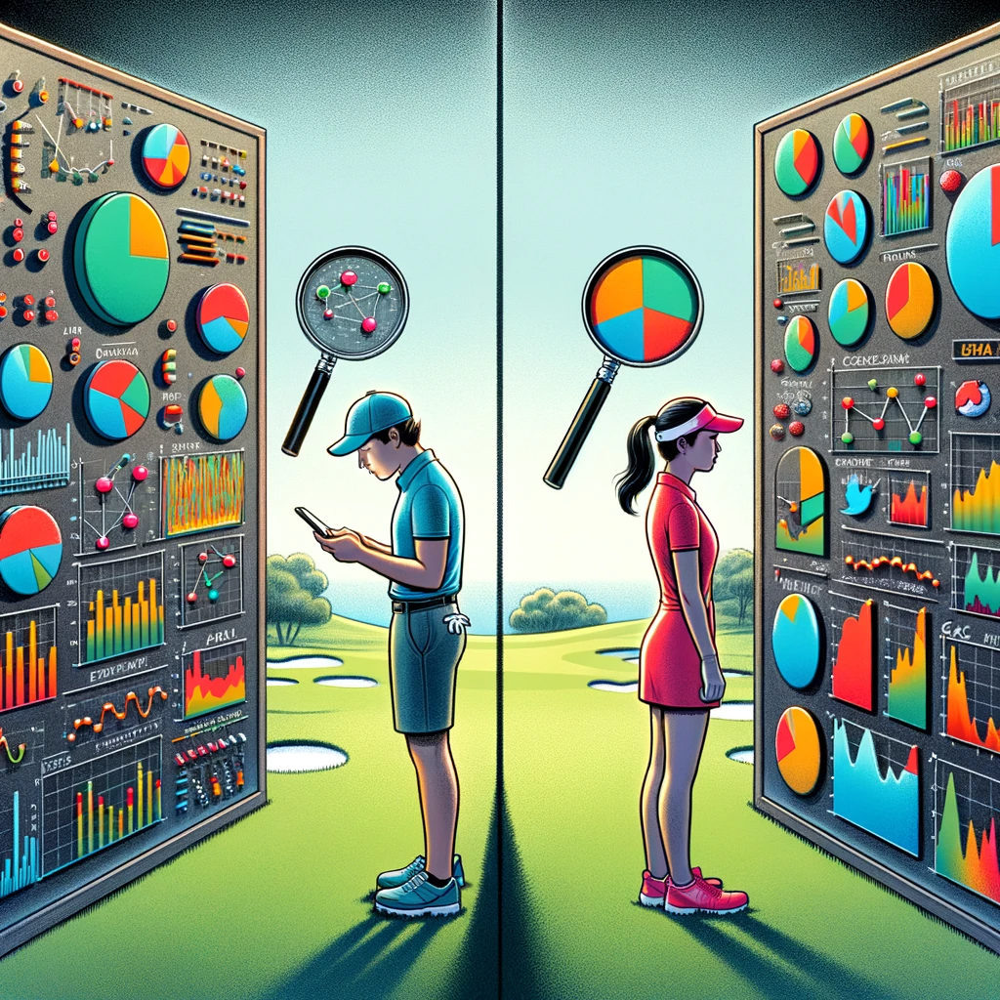

# Analyzing Gender Differences and Predictive Factors in Professional Golf Performance: A Comparative Study of PGA and LPGA Tours

<div align="center">

[[Project Report]](https://drive.google.com/file/d/19-FwjEhwABIVpY6qxvZ6Imwnv-t6WjWZ/view)
[[Code]](https://github.com/Selinali01/golf-performance-analysis)
______________________________________________________________________


</div>


## Code Structure

- ```code``` contains the analysis code.
- ```data``` contains the raw data from PGA and LPGA tournaments that I gathered for analysis. 

## Running the Code
To perform the analysis, run the following commands in sequence:

1. Data scraping (Only required for LPGA)
```
python convert_2022.py
```

2. Data Processing
```
python lpga.py
```
or
```
python pga.py
```

3. Data Analysis
```
python analysis.py
```
Change the top line import function in `analysis.py` to switch from LPGA to PGA data. 

